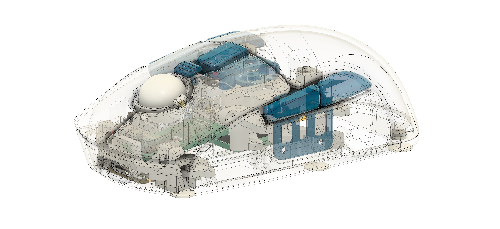

# leylabella

this is a computer mouse 🐭.

*figure 1: wireframe view in fusion360

### design principles
- symmetrical design
- 8 buttons
- no visible screws
- not-too-bad middle click
- adjustable surface sensor position. with PAW3395 breakout pcb. https://github.com/badjeff/paw3395-pcb
- mini finger trackball. with PMW3610 breakout pcb. https://github.com/badjeff/pmw3610-pcb
- mechnical trackball tightness control
- powered by [ZMK](https://github.com/zmkfirmware/zmk) => OSS, on-devie profiling, say no to (logxtxxh|razxx) eco-system
- optimized for fingertip grip and claw grip
- rigid. (Zero crackly sound)
- stupidly easy facelifting. (see CAD file, open soruced, playback the timeline)
- ligthweight. (Errr, under 80g, made by PLA body with two sensors)
- medium size (112mm x 61mm x 38mm)
- fair battery life
- silent tactile switches
- conventional scroll wheel option

### gallery

https://github.com/user-attachments/assets/b8692ff0-01a4-4cb0-a1dc-d5b0ee7fba73

### bom
|unit|item|
|-|-|
|1|Seeed Studio XIAO BLE (nRF52840)|
|1|PAW3395 Sensor with LOAE-LSI1 Lens [Breakout Board](https://github.com/badjeff/paw3395-pcb)|
|1|PWM3610 Sensor with LM18-LSI Lens [Breakout Board](https://github.com/badjeff/pmw3610-pcb)|
|8|Kailh CMI627301D07 6x6x7.3mm Silent Micro Switch|
|8|1N4148W T4 SOD-123 Diode|
|1|15mm Diameter Delrin POM Ball|
|5*|Pogo pin (2mm diameter x 2.5mm height)|
|3*|2mm static ceramic bearings (embedded in trackball socket)|
|1*|ALPS EC05-E1220401 (Vertical) Rotary Encoder|
|1|MSK-1153 6 Pins Power Switch|
|1|3x4x2mm Tact Switch Turtle Switch|
|1|M2 Screw Boxset (3-10mm)|
|4**|M2 Spacer 4mm diameter|
|4**|M2 Silicon O-ring|
|8|Neodymium Disc Magnets 5x1mm (Diameter x Thick)|
|1|601230 Lipo Battery (plus connector)|
|6|Thick Mouse Feet Skates Dots (~0.7mm)|
|1|30/28/26 AWG silicone wire|
|***|M2 Heat set inserts. ideal size: 3mm diameter x 3mm height.|

*: pogo pin and static ceramic bearings for trackball variant only. rotary encoder for scroll wheel variant only.

**: to implement PAW3395 sensor position adjustable from bottom of the body after assemble, o-rings and spacers are used to secure sensor breakout pcb on chassis.

***: need few heat set inserts if parts are going to be resin printed. all screw holes would fit m2 screws by design, requires to un-supressed feature in fusion360 CAD file to enlarge some m2 screw holes and count how many insert is needed.

### building guide / tips

- NOT for beginner. Requiring experience of building at least one wireless keyboard on [ZMK](https://github.com/zmkfirmware/zmk).
- print chassis plate with PLA, easier to screw
- print trackball socket with resin printing
- lens-to-Surface distance must >1mm & <2mm. Assuming all mouse feet is ~0.65mm thick.
- both optical sensor breakout pcb (and its lens) has the same width and height, that both can fit in the sensor rail. Therefor, surface facing sensor would be swapped to PMW3610 (yeah, dual 3610 build) if +0.5mm to all mouse feet regarding different lens focus distance.

### firmware

the ZMK firmware config repository can be find at [badjeff/leylabella-zmk-config](https://github.com/badjeff/leylabella-zmk-config).

## license

available under the [CERN-OHL-P v2](/LICENSE) permissive license.
